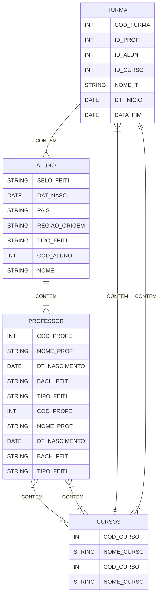

```mermaid
erDiagram
TURMA ||--|{ ALUNO : CONTEM
TURMA {
    INT COD_TURMA
    INT ID_PROF 
    INT ID_ALUN 
    INT ID_CURSO
    STRING NOME_T
    DATE DT_INICIO 
    DATE DATA_FIM   
   }
ALUNO ||--|{ PROFESSOR : CONTEM
ALUNO {
    STRING SELO_FEITI 
    DATE DAT_NASC 
    STRING PAIS 
    STRING REGIAO_ORIGEM 
    STRING TIPO_FEITI
    INT COD_ALUNO 
    STRING NOME 
    }
PROFESSOR }|--|{ CURSOS: CONTEM
PROFESSOR {
    INT COD_PROFE
    STRING NOME_PROF 
    DATE DT_NASCIMENTO 
    STRING BACH_FEITI 
    STRING TIPO_FEITI 
    }
CURSOS ||--|{ TURMA: CONTEM    
CURSOS{
    INT COD_CURSO
    STRING NOME_CURSO
    }
PROFESSOR }|--|{ CURSOS: CONTEM
PROFESSOR {
    INT COD_PROFE
    STRING NOME_PROF 
    DATE DT_NASCIMENTO 
    STRING BACH_FEITI 
    STRING TIPO_FEITI 
    }
CURSOS }|--|| TURMA: CONTEM    
CURSOS{
    INT COD_CURSO
    STRING NOME_CURSO
    }
```